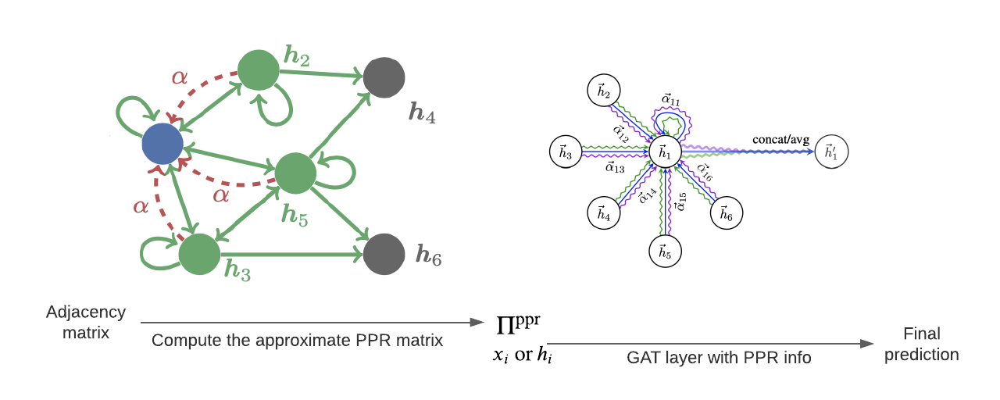

# Personalized PageRank Graph Attention Networks (PPRGATs)

This repository is the official implementation of Personalized PageRank Graph Attention Networks (ICASSP 2022) ([Paper](https://ieeexplore.ieee.org/document/9746788) | [Poster](https://sigport.org/sites/default/files/docs/ICASSP2022_PPRGAT_Poster.pdf)).



## Overview
We provide the implementation of PPRGAT in Pytorch. The repository is organised as follows:
- `layers/` contains the Graph Attention Network (GAT) layers that are necessary for our experiments;
- `models/` contains the implementation of the PPRGAT network (`pprgat.py`) alongside the benchmark models we used in our experiments;
- `utils/` contains the utility functions related to computing the approximate Personalized PageRank (PPR) matrix.

## Dependencies

The implementation has been tested under Python 3.9.7 and CUDA 11.2, with the following packages:

- `pytorch==1.10.0`
- `torch-geometric==2.0.4`

## Citation
[Personalized PageRank Graph Attention Networks](https://ieeexplore.ieee.org/document/9746788)
```
@inproceedings{
  choi2022personalized,
  author={Choi, Julie},
  booktitle={ICASSP 2022 - 2022 IEEE International Conference on Acoustics, Speech and Signal Processing (ICASSP)},
  title={Personalized Pagerank Graph Attention Networks},
  year={2022},
  volume={},
  number={},
  pages={3578-3582},
  doi={10.1109/ICASSP43922.2022.9746788}
}
```

## License
MIT


